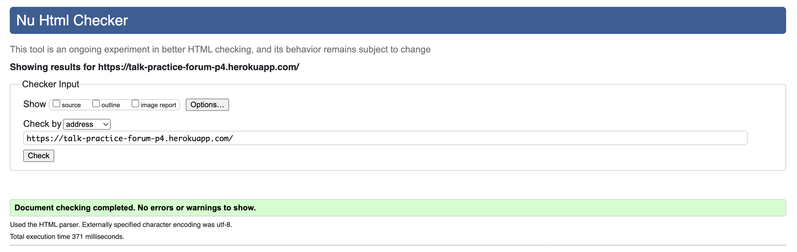

# Talk Practice Forum

 

[View the live site here](https://talk-practice-forum-p4.herokuapp.com/)
 
 

# Table of Contents
1. [Introduction](#introduction)
    1. [Aims](#aims)
    2. [User Stories](#user-stories)
2. [Main Features](#main-features)
    1. [Wireframes](#wireframes)
    2. [DataBase](#database)
    3. 
    4. 
    5. 
    6. 
    7. 
    8. 
    9. 
3. [Future Development](#future-developments)
4. [Technologies](#technologies)
    1. 
5. [Testing](#testing)
    1. [Pep8](#pep8)
    2. [Manual Testing](#manual-testing)
    3. [Tools](#tools)
    4. [Bugs](#bugs)
6. [Deployment](#deployment)
    1. [Heroku](#heroku)
    2. [Forking](#forking)
    3. [Cloning](#cloning)
7. [References & Acknowledgements](#references--acknowledgements)
   1. [References](#references)
   2. [General Reference](#general-reference)
   3. [Code Reference](#code-reference)
   4. [Code Syntax Validators](#code-syntax-validators)
   5. [Acknoledgements](#acknoledgements)
 
 

# Introduction

 
 

# Project Planning
## Aims
- Multi-user environment
- The project should utilise a full-stack framework with relevant technologies and be deployed via [Heroku](https://signup.heroku.com/)
- 
- 
- 
- 
- 
- 
 
 

## Milestones
[Milestones](https://github.com/NickWaldock/talk-practice-forum-p4/milestones)
 
 

### Epics
The main features required for this project were collated into Epics and for later distillation into [User Stories](#user-stories).
<table>
<tr><th>Epic</th><th>Details</th></tr>

<tr>
<td>Register</td>
<td>To satisfy the aim of having a multi-user environment users are required to register for an account in order to gain access to the content. Users are to be managed through the Django Admin panel. A confirmation message is displayed upon succesful login after account creation</td>
</tr>

<tr>
<td>Login & Logout</td>
<td>Users are only able to access and interact with the main content of the site if they are logged in and authenticated. For security they are also able to logout of the site at will. Certain pages will be made available depending on the status of the user as either a general user or staff/admin. A confirmation message is displayed upon succesful login and log out</td>
</tr>

<tr>
<td>Admin</td>
<td>Users who admins have given 'staff' access are able to view all areas of the site, manage posts, comments, likes, categories, and other users</td>
</tr>

<tr>
<td>View Posts</td>
<td>Authenticated users are able to view the current posts instances available in the database in a general list and also in a list specific to the category or tags. They are also able to view a single post in a detail view. A confirmation message is displayed upon succesful form submission</td>
</tr>

<tr>
<td>Create Post</td>
<td>Authenticated users are able to create new posts under their username authorship. The new post will contain a title, subtitle, category, and body. The post will be date stamped on submission and available immediately to other users. A confirmation message is displayed upon succesful form submission</td>
</tr>

<tr>
<td>Edit Post</td>
<td>Authenticated users who are the authors of a post are able to edit the fields in a pre-existing post therby updating the instance in the database. When editing, the current post content will automatically be populated on the page. Users will also be given the option to delete the post and permanently remove the database instance. A confirmation message is displayed upon succesful form submission</td>
</tr>

<tr>
<td>Delete Post</td>
<td>Authenticated users who are the authors of a post are able to fully and permanently delete a post from the database through the Edit page. Users are given a confirmation page and a choice to return or continue and delete the post. A confirmation message is displayed upon succesful deletion</td>
</tr>

<tr>
<td>UX</td>
<td>Design features to make the user experience (UX) ergonomically and aesthetically pleasing, as well as simple and intuitive to navigate</td>
</tr>
</table>

 
 

### User Stories
As a non-registered new user, I want to be able to:
- Be greeted by a landing page when I first come to the site
- Register for an account with username, optional email, and password
- Navigate to the content immediately on the creation of my account
- Easily navigate the site on my first visist
- See confirmation I have logged in successfully
- Create, and edit my personal profile
- See the page title reflected in the browser tab

 

As a registered user, I want to be able to:
- Login using my social media or google account
- Login and out of the site safely
- See confirmation I have logged in or out successfully

 

As a registered and logged in user, I want to be able to:
- See I am logged in on all pages on the site
- View a condensed list of all the forum posts
- View a condensed list of all the forum posts related to a certain category
- View posts related to tags, and view and search tags easily
- Navigate to a full-page view of the post I clicked on in the list views
- Easily navigate from a full-page article view to the post list view
- Navigate to a page to create a new post
- See a confirmation message that my new post has been submitted successfully
- See confirmation messages when my post has been updated or deleted
- See a confirmation message when I send a message through the contact form
- Submit my new post without having to input my own username as the author
- Navigate to a contact page and send a message to the site owner
- Update the title, subtitle, or body of my post
- Add or update the category from the category list on my post
- Have adequate space on the screen to compose my post
- Upload media (photos, pdfs, video, audio) alongside my post
- Only myself to have permission to edit and update my posts
- Delete my existing posts
- Only myself to be able to delete my posts
- See an 'Are you sure?' message in case I accidentally click the delete button
- See how many likes a post has, and like or unlike it
- Comment on other user's posts
- See social links and site information on all pages
- View the site clearly on any device

 

As an admin, I want to be able to:
- Create, read, update, and delete posts, or otherwise manage posts in the admin panel
- View and manage all users in the admin panel
- Create new post categories in the front-end
- Approve comments in the admin panel

 
 

## Wireframes
<table>
<tr>
<td></td>
<td>The landing page seeks to establish the clean, simple, and refined design apprach that is utilised througout the site. With a clear logo, concise information on the site's purpose, and a call to action to either login or register</td>
</tr>

<tr>
<td>The login, register, and log out pages essentially follow the same simple design and display the fields required with placeholder text and clearly demarcated buttons</td>
<td></td>
</tr>

<tr>
<td></td>
<td>The main post list view details all the current posts on the site as cards. Design uses simple contrasting black and white, boxes with non-rounded corners and small simple borders. Users can scroll through the content and click through to a full page view. The navbar at the top allows site-wide navigation and contains a dropdown menu for all the possible post categories. The sidebar becomes a feature on all pages and scrolls with the viewer, always eing in view. The sidebar is removed on mobiles and becomes a footer at the bottom of the content</td>
</tr>

<tr>
<td>The full page article view provides all the information the user needs: title, subtitle, author, date posted, relevant category, and number of likes. The page renders on a tablet as it would on a desktop and a condensed version is applied for mobile viewing</td>
<td></td>
</tr>

<tr>
<td></td>
<td>The add post page is to be simple and concise with space for a title, subtitle, and body. Form fields do not have labels in order to keep with the simplicity of design. Placeholder text informs the user what informatin should be placed there. The chevron in the category menu is important to indicate to the user a dropdown choice menu</td>
</tr>

<tr>
<td>The update post page is similar in design to the add post page with the addition of the update and delete buttons. *Post content here would need to be auto-populated</td>
<td></td>
</tr>

<tr>
<td></td>
<td>When the categories dropdown menu isn't available, as on form pages, the navbar link for categories links to a dedicated page and clealy displays the general categories that a user can browse through. The design of the links is similar to that of the cards in the list views</td>
</tr>

<tr>
<td>Finally, the contact page follows pre-exisiting design elements as on other pages, with a simple form without labels, and placeholder text to prompt the user for content</td>
<td></td>
</tr>
</table>

 
 

## Database Design

 
The database 
 
 

## Agile Methodology
[Project Kanban Board](https://github.com/users/NickWaldock/projects/5)
 
The following images represent evidence for an [Agile Methodology](https://agilemanifesto.org/) in the development of this project. 

<table>
<tr>
<td></td>
<td></td>
</tr>
<tr>
<td></td>
<td></td>
</tr>
<tr>
<td></td>
<td></td>
</tr>
<tr>
<td></td>
<td></td>
</tr>
</table>

 

[Epics](#epics) (or features) were distilled into [User Stories](#user-stories) and managed through the use of [Github Projects](https://docs.github.com/en/issues/planning-and-tracking-with-projects/learning-about-projects/about-projects). [User Stories](#user-stories) were created as issues in the main github project repository with conecting [Milestones](#milestones) and [Epics](#epics). Additional items in the project were added to the backlog during the development. The [MoSCoW](https://en.wikipedia.org/wiki/MoSCoW_method) prioritisation method was also utilies to inform workflow and categorise user stories into *'Must Have', 'Should Have', 'Could Have',* and *'Won't Have'*
 

<table>
<tr>
<td></td>
<td></td>
</tr>
<tr>
<td></td>
<td></td>
</tr>
</table>

 
 

# Main Features
## UX Desgin
### Typography
[Google Fonts](https://fonts.google.com/) supplied the two main fonts used in the site typography design.
 
 

<table>
<tr>
<td></td>
<td>Source Code Pro was used for titles and navigation and mostly in with full capitalisation. Weights of SemiBold 600 and Extra Light 200</td>
</tr>

<tr>
<td>Oxygen Mono was used for regular body, parapragph and button text. It is almost exlcusively used in lowercase format and with a weight of Regular 400</td>
<td></td>
</tr>
</table>

 
 

### Colour
The site's simplistic and elegant black & white frame design didn't intend to use much color. Only in adding additional highlights to important buttons. 
The following grey only colour added to the custom css and is used for buttons and social media icons
 

 

Additional colours for main action buttons were provided by standard [Bootstrap button classes](https://getbootstrap.com/docs/4.0/components/buttons/)

<table>
<tr>
<th>Button</th>
<th>Color / Class</th>
</tr>
<tr>
<td></td>
<td>Bootstrap 'Primary'</td>
</tr>
<tr>
<td></td>
<td>Bootstrap 'Danger'</td>
</tr>
<tr>
<td></td>
<td>Bootstrap 'Danger'</td>
</tr>
<tr>
<td></td>
<td>Bootstrap 'Secondary' + #3b3b3b</td>
</tr>
</table>

 
 

### Bootstrap
The [Bootstrap V5.3](https://getbootstrap.com/) frame work was used extensively in the formatting of this site. It's built in [grid/row](https://getbootstrap.com/docs/5.3/layout/grid/), and [cards]()https://getbootstrap.com/docs/5.3/components/card/#about system allowed for the execution of the simple wireframe design. Additional Bootstrap classes were used for custom spacing of elements on the page when required

 
 

## Database
<table>
<tr>
<td></td>
<td>

*Database chart was created using [Lucid Chart](https://www.lucidchart.com/)*   
The database schema was designed with a typical forum structure in mind and allows the capture and storage of typical forum post data. The database is hosted by [ElephantSQL](https://www.elephantsql.com/) using a [PostgresSQL](https://www.postgresql.org/) relational database structure for storing the django models data.
</td>
</tr>
<tr>
<td>The post model captures typical forum post data such as: title, subtitle, unique slug, author, date added and updated, body, likes, and a unique primary key which is generated with post creation. This model includes the additional field of 'category' to relate to the category model and allow rendering of the dynamic category menu and view pages. Future developments of this database may include media, file upload, and tag fields.</td>
<td>The comments model allows users to comment on posts created by themselves or other users. Comments are saved to the model and displayed alongside the post model data when rendered in the templates.
Finally, the contact model collects user data as a contact form and stores that data to be viewed by the admin in the django admin panel.</td>
</tr>
</table>
 
 

## CRUD

 
info

 
 

 
info

 
 

## 1. Create

 

Add post

 
 

 
add category
Dynamic nav bar menu
 
 

 
Contact form

 
 

## 2. Read / View

 
view Posts list

 
 

view full article

 
 

## 3. Update Post

 
Update Post
 
 

## 4. Delete Post

 
Delete post
 
 

## 4. Dynamic Category Menu

 
dynamic category menu
 
 

 
dynamic category list page
 
 

 
Articles by category list page
 
 

## 5. Contact Page

 
Contact page
 
 

## 6. Messages

 
Form validation and login messages
 
 

# Future Developments
This project has a great deal of developmental potential in features that could eventually add increased functionality and a deeper user experiece. 

The following are a few examples:
- Page loading by 10 posts when there are multiple posts- pagination
- Save post as draft
- Sidebar becomes footer in md and small screens
- Reset password / forgotten password links
- Search function
- Allow the user to add Tags to a post and search other posts for relevant tags. Add a tag cloud to the sidebar for easy navigation
- Rich text editor on front end, formatting the display of posts
- In the contact form, remove the checkbox asking if user is a member and code to check for this automatically on submission
- Having the post card clickable to navigate to the post rather than just the title, but still able to click the author or category to navigate
- Allow personal profiles page, to add, update user's public information
- Post author's user profile's linked to relevant posts for public viewing
- Full admin functionality to manage categories on the front-end
- A message to display when navigating to a category with no active posts
- Post pagination
- Fixed footer for mobiles - currently the user must scroll to the end of the post list to view the footer on the Home Post List View
- Add a report button for users to report inappropriate posts or comments
- Allow a user to view and manage all their own authored posts

 
 

# Technologies
Technologies used in this site are:
- [Django]() for the rendering of the database models and templates
- [Javascript]() at this point in the project JS is soley used for making django validation messages auto-dissapear, and to automatically set the current user as the 'author' in the form field for the database when adding a new post
- [HTML]() for creating the web templates and navigating between them
- [CSS]() for custom styling
- [Bootstrap]() for general layout and styling

Additional technologies include: 
- [GitHub](https://github.com/)
  - Site repository
- [Gitpod](https://gitpod.io/)
  - Online IDE for all coding work and site file management, terminal was used to add, commit, and push to Github
 
 

## Requirements
Additional requirements used in this python project include:
 

 

- 

 
 
-

 
 

# Testing
## Code Validation
### Pep8
 
All custom python files in the 'blog' directory comply with pep8 standard formatting and show no errors or warnings.
 
Django produced python files (manage.py & settings.py) raise some minor formatting errors
 
 

### HTML Validation

 
- No warnings present
 
 

### CSS Validation

 
- 1 Warning is reported: *"-webkit-sticky is a vendor extension"*
 
 

## Javascript Validation

 
 

### Lighthouse Report

 
Three detrimental messages occur in the lighthouse report, for Best Practices:
 

1. *"Includes front-end JavaScript libraries with known security vunerabilities: jQuery@3.2.1"*
2. *"Browser errors were logged to the console"* This bug is detailed [below](#bugs).
3. *"Issues were logged in the ISSUES panel in Chrome Dev Tools"* The only issue logged states: *"Audit usage of navigator.userAgent, navigator.appVersion, and navigator.platform"* A solution is proposed in the report which will be implemented in the next development cycle of the project.

 
 

## Manual Testing 
Each function and validation has been manually tested. All testing logs can her viewed here:
[>> Testing](/readme-files/manual-testing.md)
 
 

## Tools
Tools used in the development of this project include:
- [GitHub](https://github.com/)
- [GitPod](https://gitpod.io/)
- [Heroku](https://heroku.com/)
- [Lucid Chart](https://www.lucidchart.com/)
 
 

## Bugs
<table>
<tr>
<th>Description</th>
<th>Status</th>
</tr>

<tr>
  <td>On desktop - Safari: The checkbox button for the contact form renders on the left of the page and not the center as it should, and as it does in Chrome, Firefox, and Edge</td>
  <td>*SOLVED*</td>
</tr>

<tr>
  <td>On Tablets - Safari, Firefox, Chrome, Edge: The checkbox button for the contact form renders on the left of the page and not the center as it should</td>
  <td>*SOLVED*</td>
</tr>
<tr>
  <td>
   
In the Dev Tools console the above error appears. This relates to the Javascript that accounts for the display timeout django messages that appear when a user interacts with any of the forms on the site. This usually appears on a hard refresh of the site and dissapears once a form has been submitted and a  subsequent message has been displayed</td>
  <td>Unsolved</td>
</tr>
<tr>
<td>The contact page cannot be reached if not logged in. This goes against the original purpose of the contact page to be available for non-users to send enquiries, particularly as the form allows for the confirmation of member status. Either the form and model will require the member status checkbox to be removed and only registered users generally allowed to send a contact form, or the page will need to be reorganised in its relationship to the base template file in order for it to be availabel to non users.</td>
</tr>

</table>

 
 

### 1. Messages 

- 

 
 

### 2. Heroku

- On deployment to [Heroku](https://signup.heroku.com/) a irritating bug occurs within the console. The program uses specific and commonly used 'clear screen' command (from the [OS Module](https://docs.python.org/3/library/os.html)) which within the IDE GitPod functions as intended. However, within Heroku although the clear screen command seems functional, if the user scrolls up the console previous printed data can be viewed is glitched. On researching this issue I found little help, and at the time of deployment I was unable to solve this issue.
 
 

# Deployment
The live site can be accessed [here](https://talk-practice-forum-p4.herokuapp.com/)
 
 

## Heroku
This project was deloyed to [Heroku](https://heroku.com/) with the following steps:
1. Log in to Heroku (create an account if necessary)
2. Navigate to your dashboard, click "New" and select "Create new app"
3. Input an appropriate name for your project and choose a region
4. Click the "Settings" tab
5. Click "Reveal Config Vars"
6. Input PORT and 8000 as one config var and click add
7. Input CREDS and the information from your Google Sheet API creds file as another config var and click add
8. Click "Add buildpack"
9. Add "nodejs" and "python" from the list or search if required, click save.
10. Ensure python is the first build pack. YOu can drag to change the order
11. Select "Deploy" from the heading tabs
12. Select "GitHub - Connect to GitHub" next to the Deployment Methods
13. Click "Connect to GitHub"
14. Search for the repository ("practice-log") and click to connect
15. Click either 'Enable Automatic Deploys' or 'Deploy Branch' to deploy manually. If you select Deploy Branch please note you will need to manually deploy each time you update the repository.
16. Finally, click 'View' to visit the deployed site. It may take a moment to become visible
 
 

## Forking
To fork this repository on [Github](https://github.com/NickWaldock/practice-log) proceed with the following steps:
1. Log it to GitHub (create an account if necessary)
2. Locate the [GitHub Respository](https://github.com/NickWaldock/practice-log)
3. On the repository page, find the 'Fork' menu in the top right, click on the small down arrow
4. Select '+ Create a new fork'
5. Remane repository as required
6. Click 'Create Fork'
7. You now have your forked version of this repository
 
 

## Cloning
To clone the repository procees with the following steps:
1. Log in to GitHub (create an account if necessary)
2. Locate the [GitHub Respository](https://github.com/NickWaldock/practice-log)
3. On the repository page, find and click on the 'Code' menu in the mid-top right of the page
4. Choose to either download or open in GitHub Desktop,
  - or;
    5. Choose the HTTPS option and copy the URL to your clipboard
    6. - To clone the repository using HTTPS, under "HTTPS", copy the url
       - To clone the repository using an SSH key, including a certificate issued by your organization's SSH certificate authority, click SSH, then copy the url
       - To clone a repository using GitHub CLI, click GitHub CLI, then copy url
    7. Open Terminal and change the current directory to where you want the cloned directory
    8. Type git clone, and paste the url, press Enter to create your local clone
 
 

# References & Acknoledgements
- Gitpod repository template provided by [Code Institute](https://codeinstitute.net)
 
 

## General Reference
- [Python](https://www.python.org/)
General Reference

 
 

## Code Reference - Walkthroughs

 
 

### Walkthrough Reference 1
-

 
 

### Walkthrough Reference 2
- 

 
 

## Code Syntax Validators
The following sites were used for syntax and logic checking:
 
 

## Acknoledgements
I am incredibly grateful to my Code Institute Mentor Chris Quinn for his support and guidance, as well as the course providers and tutors at Code Institute for the expertise and support.

Connect with me on [LinkedIn](https://www.linkedin.com/in/nicholas-waldock-05237071/)

------------------------------------------------------------------------------------------

Improvments

References
Summernote
https://summernote.org/

Python
https://realpython.com/

Elephant SQL Database
Cloudinary media and static files hosting

For logo design
https://looka.com/

CSS
For navbar gradient
https://mdbootstrap.com/docs/standard/tools/design/gradients/

Card Hover
https://ordinarycoders.com/blog/article/codepen-bootstrap-card-hovers

Django
https://ccbv.co.uk/projects/Django/4.1/django.views.generic.edit/CreateView/
https://docs.djangoproject.com/

Slugs
https://forum.djangoproject.com/t/django-how-to-add-slug-as-arguments-in-url-tag-using-django/12636
https://forum.djangoproject.com/t/passing-slug-to-createview/4287

All Auth
https://django-allauth.readthedocs.io/en/latest/

Messages
https://docs.djangoproject.com/en/3.2/ref/contrib/messages/#using-messages-in-views-and-templates
https://stackoverflow.com/questions/24914637/show-a-successful-message-with-class-based-views
https://stackoverflow.com/questions/24822509/success-message-in-deleteview-not-shown

Random Text Generator - for post content
https://randomtextgenerator.com/