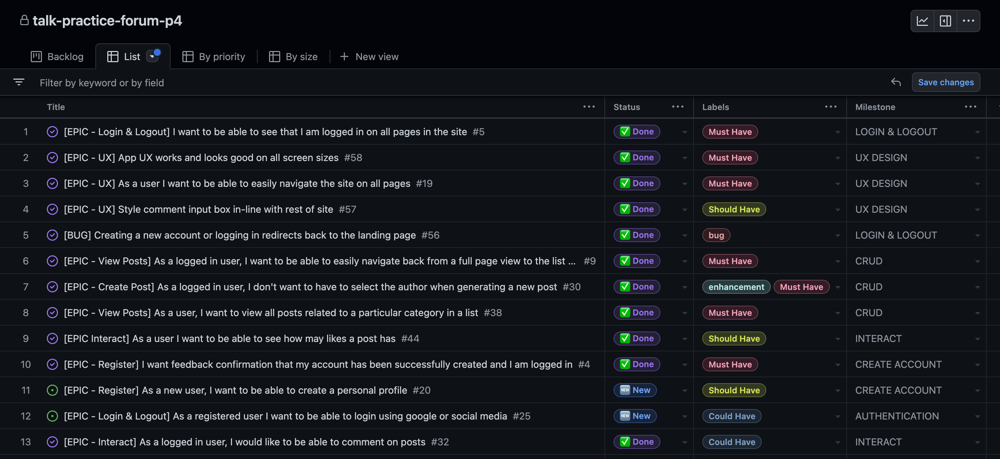
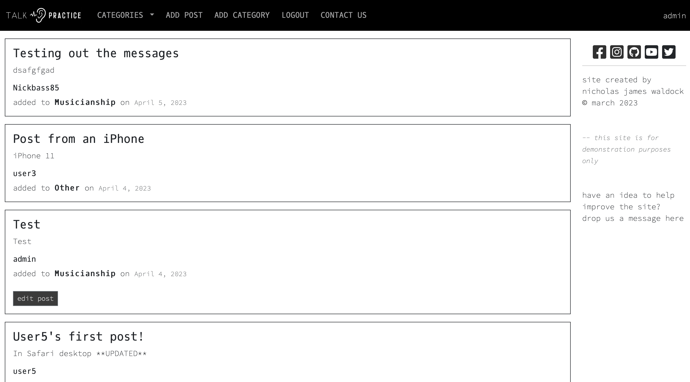

# Talk Practice Forum

 

[View the live site here](https://talk-practice-forum-p4.herokuapp.com/)
 
 

# Table of Contents
1. [Introduction](#introduction)

2. [Project Planning](#project-planning)
    - [Aims](#aims)
    - [Milestones](#milestones)
    - [Epics](#epics)
    - [User Stories](#user-stories)
    - [Wireframes](#wireframes)
    - [Database](#database)
    - [Agile Methodology](#agile-methodology)

2. [Main Features](#main-features)
    - [UX Design](#ux-desgin)
    - [Typography](#typography)
    - [Colour](#colour)
    - [Bootstrap](#bootstrap)
    [CRUD](#crud)
    1. [Add Post](#add-post)
    2. [View Post](#view-posts)
    3. [Update Post](#update-posts)
    4. [Delete Post](#delete-post)
    5. [Add Category](#add-category)
    6. [Dynamic Category Menu](#dynamic-category-menu)
    7. [Contact](#contact)
    8. [Messages](#messages)

3. [Future Development](#future-developments)

4. [Technologies](#technologies)
  1. [Requirements](#requirements)
  2. [Tools](#tools)

5. [Testing](#testing)
  1. [Pep8](#pep8)
  2. [HTML Validation](#html-validation)
  3. [CSS Validation](#css-validation)
  4. [Javascript Validation](#javascript-validation)
  5. [Lighthouse Report](#lighthouse-report)
  6. [Manual Testing](#manual-testing)
  7. [Bugs](#bugs)

6. [Deployment](#deployment)
  1. [Heroku](#heroku)
  2. [Forking](#forking)
  3. [Cloning](#cloning)

7. [References & Acknowledgements](#references--acknowledgements)
  1. [General Reference](#general-reference)
  2. [Code Reference](#code-reference)
  3. [Acknoledgements](#acknoledgements)
 
 

# Introduction

This project forms the 4th submission for my participation in [Code Institute's](https://codeinstitute.net) Full Stack Software Developer Diploma. The inspiration for the project comes as a continuation from my previous Python-based project [*Nick's Practice Log*](https://github.com/NickWaldock/practice-log), a chat-based CLI program designed to log the details of a musician's practice routine. The *Talk Practice* project is designed as a forum site for musicians to discuss musical practice with the aim to eventually allow users to log individual practice records and data, and gain analytics and insights on that data. Many music forums exist on all manner of musical topics, manily around the subject of equipment, but there are very few that exist (if any) that center around the topic of musical practice. It is this gap that the *Talk Practice* project attempts to fill.

 
 

# Project Planning
## Aims
1. **Site Owner's Aims**
  - Create a multi-user environment platform that acts as a dedicated musician's practice forum allowing users to share and discuss musical practice and development ideas
 

2. **User's Goal**
  - To have a dedicated and bespoke space to find, share, discuss, and comment on information that may be useful in their individual musical practice journey

3. **Additional Aims**
  - Utilise [Django](https://www.djangoproject.com/) as the main MVC technology for rendering the database information
  - Utilise a relational database schema to store data
  - Have full CRUD functionality, commenting, likes, and category filters
  - Use an [Agile](https://en.wikipedia.org/wiki/Agile_software_development) planning and development methodology
  - Include user authorisation and permissions
  - The project should utilise a full-stack framework with relevant technologies and be deployed via [Heroku](https://signup.heroku.com/)

 

## Milestones
The project [Milestones](https://github.com/NickWaldock/talk-practice-forum-p4/milestones) were developed as part of the Agile methodology and in conjuction with the aims of the project.
  
These include:
- 'User Experience Design' - for general site aesthetics;
- 'CRUD' functionality - for manipluating data on the front-end (Create, Read, Update, & Delete); 
- 'User Authentication' - so users can only access relevant and appropriate parts of the site;
- 'Login & Logout' - safe and secure login and logout protocols;
- 'Create Account' - allow new users to join the forum; 
- 'Admin' - allow site administrators to manage users and data;
- 'Interaction' - allow users to interact with other user's data in the form of comments and likes
 
 

## Epics
The main features required for this project were collated into Epics and incorporated general functionality for certain features and reflecting the project milestones
 
<table>
<tr><th>Epic</th><th>Details</th></tr>
<tr>
<td>Register</td>
<td>To satisfy the aim of having a multi-user environment users are required to register for an account in order to gain access to the content. Users are to be managed through the Django Admin panel. A confirmation message is displayed upon succesful login after account creation</td>
</tr>

<tr>
<td>Login & Logout</td>
<td>Users are only able to access and interact with the main content of the site if they are logged in and authenticated. For security they are also able to logout of the site at will. Certain pages will be made available depending on the status of the user as either a general user or staff/admin. A confirmation message is displayed upon succesful login and log out</td>
</tr>

<tr>
<td>Admin</td>
<td>Users who admins have given 'staff' access are able to view all areas of the site, manage posts, comments, likes, categories, and other users</td>
</tr>

<tr>
<td>View Posts</td>
<td>Authenticated users are able to view the current posts instances available in the database in a general list and also in a list specific to the category or tags. They are also able to view a single post in a detail view. A confirmation message is displayed upon succesful form submission</td>
</tr>

<tr>
<td>Create Post</td>
<td>Authenticated users are able to create new posts under their username authorship. The new post will contain a title, subtitle, category, and body. The post will be date stamped on submission and available immediately to other users. A confirmation message is displayed upon succesful form submission</td>
</tr>

<tr>
<td>Edit Post</td>
<td>Authenticated users who are the authors of a post are able to edit the fields in a pre-existing post therby updating the instance in the database. When editing, the current post content will automatically be populated on the page. Users will also be given the option to delete the post and permanently remove the database instance. A confirmation message is displayed upon succesful form submission</td>
</tr>

<tr>
<td>Delete Post</td>
<td>Authenticated users who are the authors of a post are able to fully and permanently delete a post from the database through the Edit page. Users are given a confirmation page and a choice to return or continue and delete the post. A confirmation message is displayed upon succesful deletion</td>
</tr>

<tr>
<td>UX</td>
<td>Design features to make the user experience (UX) ergonomically and aesthetically pleasing, as well as simple and intuitive to navigate</td>
</tr>
</table>

 
 

## User Stories
User stories were then formulated to further direct the development efforts. User stories were then inputed into [Github Projects](https://github.com/users/NickWaldock/projects/5) for distribution and prioritisation using the [MoSCoW](https://en.wikipedia.org/wiki/MoSCoW_method) method. Screenshots of the project kanban board and userstories is available [here](#agile-methodology)

As a non-registered new user, I want to be able to:
- Be greeted by a landing page when I first come to the site
- Register for an account with username, optional email, and password
- Navigate to the content immediately on the creation of my account
- Easily navigate the site on my first visist
- See confirmation I have logged in successfully
- Create, and edit my personal profile
- See the page title reflected in the browser tab

 

As a registered user, I want to be able to:
- Login using my social media or google account
- Login and out of the site safely
- See confirmation I have logged in or out successfully

 

As a registered and logged in user, I want to be able to:
- See I am logged in on all pages on the site
- View a condensed list of all the forum posts
- View a condensed list of all the forum posts related to a certain category
- View posts related to tags, and view and search tags easily
- Navigate to a full-page view of the post I clicked on in the list views
- Easily navigate from a full-page article view to the post list view
- Navigate to a page to create a new post
- See a confirmation message that my new post has been submitted successfully
- See confirmation messages when my post has been updated or deleted
- See a confirmation message when I send a message through the contact form
- Submit my new post without having to input my own username as the author
- Navigate to a contact page and send a message to the site owner
- Update the title, subtitle, or body of my post
- Add or update the category from the category list on my post
- Have adequate space on the screen to compose my post
- Upload media (photos, pdfs, video, audio) alongside my post
- Only myself to have permission to edit and update my posts
- Delete my existing posts
- Only myself to be able to delete my posts
- See an 'Are you sure?' message in case I accidentally click the delete button
- See how many likes a post has, and like or unlike it
- Comment on other user's posts
- See social links and site information on all pages
- View the site clearly on any device

 

As an admin, I want to be able to:
- Create, read, update, and delete posts, or otherwise manage posts in the admin panel
- View and manage all users in the admin panel
- Create new post categories in the front-end
- Approve comments in the admin panel

 
 

## Wireframes
Wireframe designs were mocked up to visualise the basic design of the site in-line with the user stories and allowed a visual guide for development
  
<table>
<tr>
<td></td>
<td>The landing page seeks to establish the clean, simple, and refined design apprach that is utilised througout the site. With a clear logo, concise information on the site's purpose, and a call to action to either login or register</td>
</tr>

<tr>
<td>The login, register, and log out pages essentially follow the same simple design and display the fields required with placeholder text and clearly demarcated buttons</td>
<td></td>
</tr>

<tr>
<td></td>
<td>The main post list view details all the current posts on the site as cards. Design uses simple contrasting black and white, boxes with non-rounded corners and small simple borders. Users can scroll through the content and click through to a full page view. The navbar at the top allows site-wide navigation and contains a dropdown menu for all the possible post categories. The sidebar becomes a feature on all pages and scrolls with the viewer, always eing in view. The sidebar is removed on mobiles and becomes a footer at the bottom of the content</td>
</tr>

<tr>
<td>The full page article view provides all the information the user needs: title, subtitle, author, date posted, relevant category, and number of likes. The page renders on a tablet as it would on a desktop and a condensed version is applied for mobile viewing</td>
<td></td>
</tr>

<tr>
<td></td>
<td>The add post page is to be simple and concise with space for a title, subtitle, and body. Form fields do not have labels in order to keep with the simplicity of design. Placeholder text informs the user what informatin should be placed there. The chevron in the category menu is important to indicate to the user a dropdown choice menu</td>
</tr>

<tr>
<td>The update post page is similar in design to the add post page with the addition of the update and delete buttons. *Post content here would need to be auto-populated</td>
<td></td>
</tr>

<tr>
<td></td>
<td>When the categories dropdown menu isn't available, as on form pages, the navbar link for categories links to a dedicated page and clealy displays the general categories that a user can browse through. The design of the links is similar to that of the cards in the list views</td>
</tr>

<tr>
<td>Finally, the contact page follows pre-exisiting design elements as on other pages, with a simple form without labels, and placeholder text to prompt the user for content</td>
<td></td>
</tr>
</table>

 
 

## Database
<table>
<tr>
<td></td>
<td>
The database schema was designed with a typical forum structure in mind and allows the capture and storage of typical forum post data. The database is hosted by [ElephantSQL](https://www.elephantsql.com/) using a [PostgresSQL](https://www.postgresql.org/) relational database structure for storing the django models data.  
The post model captures typical forum post data such as: title, subtitle, unique slug, author, date added and updated, body, likes, and a unique primary key which is generated with post creation. This model includes the additional field of 'category' to relate to the category model and allow rendering of the dynamic category menu and view pages. Future developments of this database may include media, file upload, and tag fields.  
The comments model allows users to comment on posts created by themselves or other users. Comments are saved to the model and displayed alongside the post model data when rendered in the templates.
Finally, the contact model collects user data as a contact form and stores that data to be viewed by the admin in the django admin panel.
</td></tr>
</table>

*Database chart was created using [Lucid Chart](https://www.lucidchart.com/)*
  

## Agile Methodology
[Project Kanban Board](https://github.com/users/NickWaldock/projects/5)
 
The following images represent evidence for an [Agile Methodology](https://agilemanifesto.org/) in the development of this project. Once user stories were developed and inputted they become part of the project backlog and managed in this [Kanban project tool]((https://github.com/users/NickWaldock/projects/5)).
<table>
<tr>
<td></td>
<td></td>
</tr>
<tr>
<td></td>
<td></td>
</tr>
<tr>
<td></td>
<td></td>
</tr>
<tr>
<td></td>
<td></td>
</tr>
</table>

 

[Epics](#epics) (or features) were distilled into [User Stories](#user-stories) and managed through the use of [Github Projects](https://docs.github.com/en/issues/planning-and-tracking-with-projects/learning-about-projects/about-projects). [User Stories](#user-stories) were created as issues in the main github project repository with conecting [Milestones](#milestones) and [Epics](#epics). Additional items in the project were added to the backlog during the development. The [MoSCoW](https://en.wikipedia.org/wiki/MoSCoW_method) prioritisation method was also utilies to inform workflow and categorise user stories into *'Must Have', 'Should Have', 'Could Have',* and *'Won't Have'*
 

<table>
<tr>
<td></td>
<td></td>
</tr>
<tr>
<td></td>
<td></td>
</tr>
</table>

 
 

# Main Features
## UX Desgin
### Typography
[Google Fonts](https://fonts.google.com/) supplied the two main fonts used in the site typography design.
 
 

 

- Source Code Pro was used for titles and navigation and mostly in with full capitalisation. Weights of SemiBold 600 and Extra Light 200
  

 

- Oxygen Mono was used for regular body, parapragph and button text. It is almost exlcusively used in lowercase format and with a weight of Regular 400

 

### Colour
The site's simplistic and elegant black & white frame design didn't intend to use much color. Only in adding additional highlights to important buttons  

- The following grey only colour added to the custom css and is used for buttons and social media icons
 

  

Additional colours for main action buttons were provided by standard [Bootstrap button classes](https://getbootstrap.com/docs/4.0/components/buttons/)

<table>
<tr>
<th>Button</th>
<th>Color / Class</th>
</tr>
<tr>
<td></td>
<td>Bootstrap 'Primary'</td>
</tr>
<tr>
<td></td>
<td>Bootstrap 'Danger'</td>
</tr>
<tr>
<td></td>
<td>Bootstrap 'Danger'</td>
</tr>
<tr>
<td></td>
<td>Bootstrap 'Secondary' + #3b3b3b   *'Secondary' class is added so bootstrap hover effects still function, saving the need of additional css code</td>
</tr>
</table>

 

### Bootstrap
The [Bootstrap V5.3](https://getbootstrap.com/) frame work was used extensively in the formatting of this site. It's built in [grid/row](https://getbootstrap.com/docs/5.3/layout/grid/), and [cards]()https://getbootstrap.com/docs/5.3/components/card/#about system allowed for the execution of the simple wireframe design. Additional Bootstrap classes were used for custom spacing of elements on the page when required

 
 

## CRUD
Create, read, update, delete functionality are part of the main requirments of this project. Below details are given of how these functions are intigrated into the site on the front-end   

### Add Post
<table>
<tr>
<td>The first major piece of CRUD functionality is the ability to create a new post. Here, only authenticated users can access this page and generate a new post and new instance of the Post database model</td>
<td></td>
<td></td>
</tr>
</table>

 

### View Post(s)
<table>
<tr>
<td>
The second major piece of CRUD functionality is the ability to view all published posts that currently exist in the database and filter those posts using the category funciton. Users can view the enitre list of posts which automatically order by most recent *(right)*; the list of available categories *(below)*, which adapts automatically when new categories are added by admins; and the list of posts within an available category *(below, right)*

Here, only authenticated users can access this page and generate a new post and new instance of the Post database model</td>
<td></td>
<td></td>

</tr>
<tr>
<td>
</td>
<td></td>
<td></td>
</tr>
</table>
 

<table>
<tr>
<td>The main article view allows the user to fully experience the article's details, including the date, number of likes, view comments. Available links on this page include the category which links the user to the list of posts associated with the current category. </td>
<td></td>
<td></td>
</tr>
<tr>
<td>The user is also able to interact with the post for the first time by liking and commenting. Once again, the edit button is only available for the user who is the post's author. This button similarly directs the user to the update post page. Note the sidebar has also migrated down the page to maintain in view</td>
<td></td>
</tr>
<tr>
<td>In this image the user has commented on, and liked a post. The comment becomes available and the like button switches to an unlike button if the user decides to withdraw the like</td>
<td></td>
<td></td>
</tr>
</table>

 

### Update Posts
<table>
<tr>
<td>
Similarly to the add post page, the update post page allows users to edit the contents of a prexisting database instance of the Post model. The page is navigated to through any of the view forms on a card that has the 'edit' button. 
<td>The edit button only exists on a card if the logged-in user is recognised as the post author, thereby only allowing the correct user to access the edit post page. Relevant data from the database is rendered on the page for the user to edit. The user then has the option to update the post and updating the database according, or to delete the post which navigates to a confirmation of intention to delete page</td>
</td>
</tr>

<tr>
<td></td>
<td></td>
</tr>
</table>

  

### Delete Post

<table>
<tr>
<td>If a user has the correct permissions (i.e. is the author) to access the update post page for a particular post then the option to delete the post is also available via the delete button. If the user clicks this they are then forwarded to this page which confirms the user's intent to delete. This delete page contains the title of the post selected to be deleted and the option to continue to delete or return. Clicking delete permanently removes the instance of the post and redirects the user back to the main post list view, or 'home'. Clicking the return button, also redirects the user to the home view but leaves the instance of the post intact</td>
<td></td>

</tr>
</table>

  

### Add Category
 

  
If a user is recognised as admin/staff then the add category nav link becomes available. This feature is the first part of a planned [future development](#future-developments) to allow the admins front-end management functionality for the site. This simple page allows the admin to add a new category to the database for future posts to be filitered by. This category list is reflected in the following navbar dropdown and category list page. On clicking the add button, the inputted category is saved to the database and the admin is redirected to the main home page list view
  

  

### Dynamic Category Menu

<table>
<tr>
<td>When the category list is updated this is immediately reflected in the category dropdown menu in the navbar. This is available to all users and allows them to directly visit a list of posts relating to the particular category</td>
<td></td>
</tr>
</table>

  

### Contact
<table>
<tr>
<td>The contact page allows the user to send a message to the site owners. This page is available to all users including un-registered users. The form includes name, email, subject, and message fields, as well as a checkbox for the admins arrange and collate messages from non-users. Clicking the send button posts the form data to the database which becomes available for the admins to view in the django admin panel</td>
<td></td>
</tr>
</table>

  

### Messages
 
The site utilises Django's built-in [messaging](https://docs.djangoproject.com/en/4.1/ref/contrib/messages/) framework and displays a message to the user in the event of a successful login, logout, post creation, post update, post deletion, and category creation

<table>
<tr>
<td>Message displays from a successful login</td>
<td></td>
</tr>
<tr>
<td></td>
<td>Message displays from a successful logout</td>
</tr>
<tr>
<td>Message displays from a successful post creation</td>
<td></td>
</tr>
<tr>
<td></td>
<td>Message displays from a successful post update</td>
</tr>
<tr>
<td>Message displays from a successful post deletion</td>
<td></td>
</tr>
</table>

 
 

# Future Developments
This project has a great deal of developmental potential in features that could eventually add increased functionality and a deeper user experiece. 

The following are a few examples:
- Page loading by 10 posts when there are multiple posts (pagination)
- The ability for users to save post as draft before publishing
- Users able to manage all of their posts in a single page
- Reset password / forgotten password links
- Search function to search site-wide
- Allow the user to add Tags to a post and search other posts for relevant tags. Add a tag cloud to the sidebar for easy navigation
- Rich text editor on front end, formatting the display of posts
- Posts maintain their formatting when being displayed
- In the contact form, remove the checkbox asking if user is a member and code to check for this automatically on submission
- Having the post card clickable to navigate to the post rather than just the title, but still able to click the author or category to navigate
- Allow personal profiles page, to add, update user's public information. Make this available to users as a link from author's name on posts
- Post author's user profile's linked to relevant posts for public viewing
- Full admin functionality to manage categories on the front-end
- A message to display when navigating to a category with no active posts
- Footer for mobiles - currently the user must scroll to the end of the post list to view the footer on the Home Post List View
- Add a report button for users to report inappropriate posts or comments
- Allow a user to view and manage all their own authored posts
- Allow users to upload media alongside posts. Video, audio, pdf, files, etc and tag these as desired
- Create app for users to log their own practice sessions with data such as duration, focus-level score, date, practice material, notes; and allow them to gain insights based-on their shared data

 
 

# Technologies
Technologies used in this site are:
- [Django](https://www.djangoproject.com/) for the rendering of the database models and templates
- [ElephantSQL](https://www.elephantsql.com/) for hosting and managing the database
- [Javascript](https://www.javascript.com/) at this point in the project JS is soley used for making django validation messages auto-dissapear, and to automatically set the current user as the 'author' in the form field for the database when adding a new post
- [HTML](https://en.wikipedia.org/wiki/HTML) for creating the web templates and navigating between them
- [CSS](https://en.wikipedia.org/wiki/CSS) for custom styling
- [Bootstrap](https://getbootstrap.com/) for general layout and styling
- [AllAuth](https://django-allauth.readthedocs.io/en/latest/)
    - Integrated djagno applications managing authentication, registration and account management
- [Summernote](https://summernote.org/)
    - Text editor 
- Additional project requirements can be viewed in the [requirememts.txt](requirements.txt) file

## Tools
Tools used in the development of this project include:
- [GitHub](https://github.com/)
    - Site repository
- [GitPod](https://gitpod.io/) 
    - Online IDE for all coding work and site file management, terminal was used to add, commit, and push to Github
- [Heroku](https://heroku.com/) 
    - Deployment Host
- [Lucid Chart](https://www.lucidchart.com/) 
    - Database Chart
- [Balsamiq](https://balsamiq.com/) 
    - Wireframes
- [Chrome Dev Tools](https://developer.chrome.com/docs/devtools/)
    - Browser developer tools
- [Cloudinary](https://cloudinary.com/)
    - Static files hosting
- [Looka](https://looka.com/)
    - Logo design
- [Random Text Generator](https://randomtextgenerator.com/)
    - Random text generator for test posts

 
 

# Testing
## Pep8
 
All custom python files in the 'blog' directory comply with pep8 standard formatting and show no errors or warnings.
 
Django produced python files (manage.py & settings.py) raise some minor formatting errors
 
 

## HTML Validation
All HTML validation tests returned with no errors or warnings
 
<table>
<tr>
<td></td>
<td></td>
<td></td>
</tr>

<tr>
<td></td>
<td></td>
<td></td>
</tr>

<tr>
<td></td>
<td></td>
<td></td>
</tr>
<tr><td><td></td></td></tr>
</table>

  

## CSS Validation

 
- 1 Warning is reported: *"-webkit-sticky is a vendor extension"* which relates to Bootstrap

  

## Javascript Validation

  

## Lighthouse Report

 
Three detrimental messages occur in the lighthouse report, for Best Practices:
 

1. *"Includes front-end JavaScript libraries with known security vunerabilities: jQuery@3.2.1"*
2. *"Browser errors were logged to the console"* This bug is detailed [below](#bugs).
3. *"Issues were logged in the ISSUES panel in Chrome Dev Tools"* The only issue logged states: *"Audit usage of navigator.userAgent, navigator.appVersion, and navigator.platform"* A solution is proposed in the report which will be implemented in the next development cycle of the project.

  

## Manual Testing 
Each function and validation has been manually tested. All testing logs can her viewed here:
[>> Testing](/readme-files/manual-testing.md)
  

## Bugs
<table>
<tr>
<th>Number</th>
<th>Description</th>
<th>Status</th>
</tr>

<tr>
<td>1</td>
  <td>On desktop - Safari: The checkbox button for the contact form renders on the left of the page and not the center as it should, and as it does in Chrome, Firefox, and Edge</td>
  <td>*SOLVED*</td>
</tr>

<tr>
<td>2</td>
  <td>On Tablets - Safari, Firefox, Chrome, Edge: The checkbox button for the contact form renders on the left of the page and not the center as it should</td>
  <td>*SOLVED*</td>
</tr>
<tr>
<td>3</td>
  <td>
   
In the Dev Tools console the above error appears. This relates to the Javascript that accounts for the display timeout django messages that appear when a user interacts with any of the forms on the site. This usually appears on a hard refresh of the site and dissapears once a form has been submitted and a  subsequent message has been displayed</td>
  <td>Unsolved - Bug Logged</td>
  <td></td>
</tr>
<tr>
<td>4</td>
<td>The contact page cannot be reached if not logged in. This goes against the original purpose of the contact page to be available for non-users to send enquiries, particularly as the form allows for the confirmation of member status. Either the form and model will require the member status checkbox to be removed and only registered users generally allowed to send a contact form, or the page will need to be reorganised in its relationship to the base template file in order for it to be availabel to non users.</td>
<td>*SOLVED* - page can now be reached as expected</td>
</tr>
<tr>
<td>5</td>
<td>Currently, if an admin deletes a category in the admin panel that has posts associated with it this is not delete the associated posts. The category is removed from the navigation bar and category list page, but the post still exists in the main list view. Clicking on that category still navigates the user to the category post list view of the deleted category.</td>
<td>Unsolved - Bug Logged</td>
<td></td>
</tr>
</table>

  

# Deployment
The live site can be accessed [here](https://talk-practice-forum-p4.herokuapp.com/)
 
 

## Heroku
To deploy on Heroku:
1. Log in to [Heroku](https://www.heroku.com/) (create an account if necessary)
2. From the dashboard, click on the "New" button and select "Create new app"
3. Choose an appropriate name for your app and select the region closest to your location
4. Access the "Settings" tab
5. Click on "Reveal Config Vars"
6. Add all necessary key-value pairs from the .env file. Make sure not to include DEBUG and      DEVELOPMENT variables.
7. Click on "Add buildpack" and add "python" from the list. Click "save"
8. Access the "Deploy" tab
9. Select "GitHub - Connect to GitHub" from the deployment methods and click on "Connect to GitHub"
10. Search for the relevant GitHub repository and click it
11. Choose automatic deploys to allow the deployed site to be updated each time code is pushed to GiHub
12. Click "View" to view the deployed site. The site is now deployed!
  

## Forking
To fork this repository on [Github](https://github.com/NickWaldock/practice-log) proceed with the following steps:
1. Log it to GitHub (create an account if necessary)
2. Locate the [GitHub Respository](https://github.com/NickWaldock/practice-log)
3. On the repository page, find the 'Fork' menu in the top right, click on the small down arrow
4. Select '+ Create a new fork'
5. Remane repository as required
6. Click 'Create Fork'
7. You now have your forked version of this repository
 
 

## Cloning
To clone the repository procees with the following steps:
1. Log in to GitHub (create an account if necessary)
2. Locate the [GitHub Respository](https://github.com/NickWaldock/practice-log)
3. On the repository page, find and click on the 'Code' menu in the mid-top right of the page
4. Choose to either download or open in GitHub Desktop,
  - or;
    5. Choose the HTTPS option and copy the URL to your clipboard
    6. - To clone the repository using HTTPS, under "HTTPS", copy the url
       - To clone the repository using an SSH key, including a certificate issued by your organization's SSH certificate authority, click SSH, then copy the url
       - To clone a repository using GitHub CLI, click GitHub CLI, then copy url
    7. Open Terminal and change the current directory to where you want the cloned directory
    8. Type git clone, and paste the url, press Enter to create your local clone

  

# References & Acknowledgements
- Gitpod repository template provided by [Code Institute](https://codeinstitute.net)
  

## General Reference
- [Python](https://www.python.org/)
- [PyPi](https://pypi.org/)
- [Real Python](https://realpython.com/)
- [Card Hover](https://ordinarycoders.com/blog/article/codepen-bootstrap-card-hovers)
- [Django Reference](https://docs.djangoproject.com/)
- [Django Slugs 1](https://forum.djangoproject.com/t/django-how-to-add-slug-as-arguments-in-url-tag-using-django/12636)
- [Django Slugs 2](https://forum.djangoproject.com/t/passing-slug-to-createview/4287)
- [Django AllAuth](https://django-allauth.readthedocs.io/en/latest/)
- [Django Messages 1](https://docs.djangoproject.com/en/3.2/ref/contrib/messages/#using-messages-in-views-and-templates)
- [Django Messages 2](https://stackoverflow.com/questions/24914637/show-a-successful-message-with-class-based-views)
- [Django Messages 3](https://stackoverflow.com/questions/24822509/success-message-in-deleteview-not-shown)

  

## Code Reference - Walkthroughs
The following walkthrough projects were used as inspiration and code was adapted for this project
- [Code Institute's 'Hello Django'](https://codeinstitute.net/)
- [Code Institute's 'CodeStar Blog'](https://codeinstitute.net/)
- [Codemy.com](https://www.youtube.com/playlist?list=PLCC34OHNcOtr025c1kHSPrnP18YPB-NFi)
- [Udemy](https://www.udemy.com/course/django-project-djblogger/?utm_source=adwords&utm_medium=udemyads&utm_campaign=LongTail_la.EN_cc.UK&utm_content=deal4584&utm_term=_._ag_76288949676_._ad_532713168364_._kw__._de_c_._dm__._pl__._ti_dsa-787269366885_._li_9046639_._pd__._&matchtype=&gclid=Cj0KCQjw27mhBhC9ARIsAIFsETGU4HA2rjldlK9JD15z3_SyRyS5Y7Jt2aaOqUrdyAW-rStT_lHRDkwaAssLEALw_wcB)
 
 

## Acknoledgements
I am incredibly grateful to my Code Institute Mentor Chris Quinn for his support, knowledge, and guidance, as well as the course providers and tutors at Code Institute for their expertise and support

Connect with me on [LinkedIn](https://www.linkedin.com/in/nicholas-waldock-05237071/) or through my [website](https://www.nicholasjameswaldock.uk)if you would like to discuss any of my projects or the prospect of working together

Thanks for stopping by, and Happy Practicing!
  

------------------------------------------------------------------------------------------